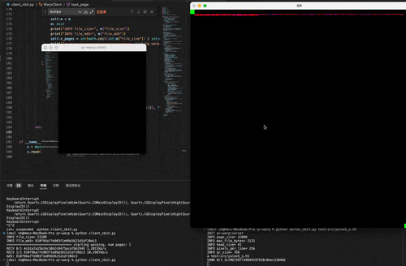

# RDP Synchronizer
基于rdp协议的文件像素传输工具，可靠传输，110kb/s左右


## 使用方法
安装相关python依赖：
```shell
pip install pyuserinput numba mss pyautogui
```

远程rdp发送端:
```shell
python server_nbit.py my_file
```

本地接收端（点击使焦点位于rdp窗口，然后移动鼠标对齐绿色标记）:
```shell
python client_nbit.py
```
